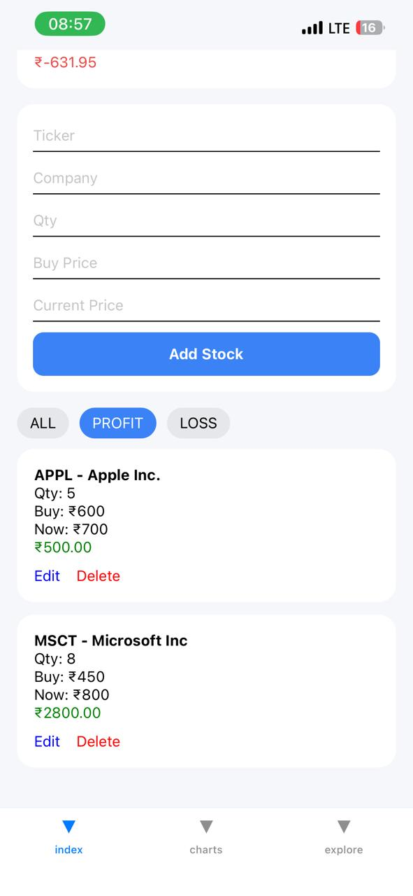
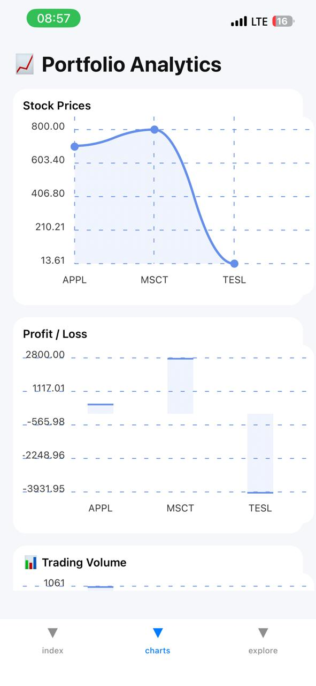
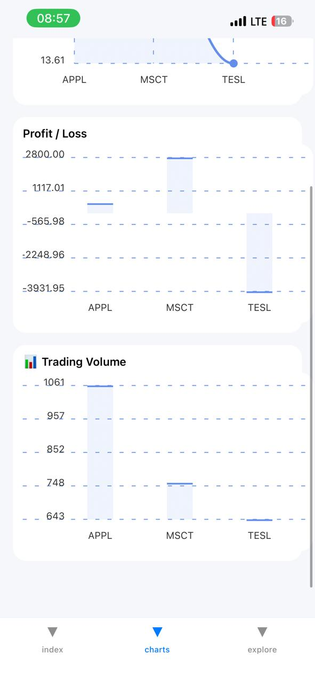
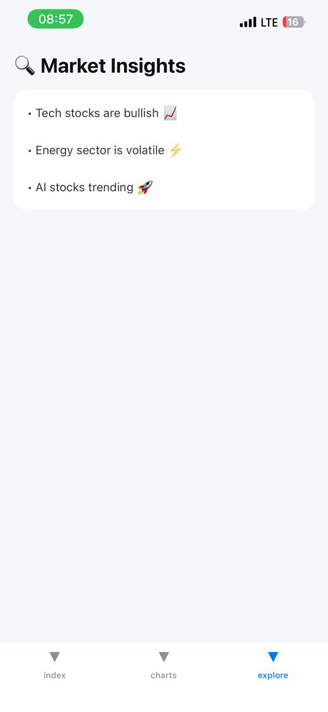

# 📈 React Native Stock App

A modern **React Native Stock Market Tracking Application** that allows users to monitor stock prices, visualize trends using interactive charts, and manage a personal portfolio. The app focuses on clean UI, smooth performance, and real-time financial insights.

---

## ✨ Features

- 📊 Real-time stock price tracking  
- 📈 Interactive charts (line/bar visualization)  
- 💼 Portfolio / Watchlist management  
- 📉 Historical stock data visualization  
- 📋 Portfolio performance summary  
- ⚡ Fast and responsive UI  
- 🎨 Clean and minimal user interface  

---

## 🛠️ Tech Stack

- React Native  
- JavaScript / TypeScript  
- React Navigation  
- Zustand / Redux (State Management)  
- react-native-chart-kit  
- Stock Market API (Alpha Vantage / Finnhub / Yahoo Finance)  
- Axios / Fetch API  

---

## 📱 App Screens

- 🏠 Explore Screen – Portfolio overview & market summary  
- 📊 Charts Screen – Stock price visualization with graphs  
- 💼 Portfolio Screen – Saved stocks and performance tracking  

---

## 🏗️ Project Structure

```bash
react-native-stock-app/
│
├── src/
│   ├── components/
│   ├── screens/
│   ├── navigation/
│   ├── store/
│   ├── services/
│   └── utils/
│
├── assets/
│   └── screenshots/
│       ├── home1.png
│       ├── home2.png
│       ├── home3.png
│       ├── home4.png
│       ├── chart1.png
│       ├── chart2.png
│       └── explore.png
│
├── App.tsx
├── package.json
├── .gitignore
└── README.md

⚙️ Installation

Clone the repository:

git clone https://github.com/PriyaShilpakar3/react-native-stock-app.git
cd react-native-stock-app

Install dependencies:

npm install
# or
yarn install

Install dependencies:

npm install
# or
yarn install

🔑 Environment Variables

Create a .env file in the root directory:

STOCK_API_KEY=KKUAWJ0ZZPMC3QGR
BASE_URL=https://www.alphavantage.co/query


📊 Core Functionality

  Fetch live stock data from API

  Render dynamic stock charts
  Store and manage portfolio locally/state
  Track stock performance over time
  Visual comparison of gains/losses


## 📸 Screenshots

### 🏠 Index Page

| Screen 1 | Screen 2 |
|----------|----------|
|  |  |

| Screen 3 | Screen 4 |
|----------|----------|
|  |  |

---

### 📊 Charts Page

| Chart View 1 | Chart View 2 |
|--------------|--------------|
|  |  |

---

### 🔍 Explore Page

| Explore Screen |
|----------------|
|  |
---


🧠 Future Enhancements


🔔 Push notifications for price alerts


📰 Real-time financial news integration


🤖 AI-based stock prediction system


🔍 Stock search functionality


☁️ Cloud sync for portfolio backup


📊 Advanced analytics dashboard


🚀 Key Highlights


Optimized React Native performance


Modular and scalable architecture


Reusable component-based design


Clean separation of concerns (UI, API, State)


🤝 Contributing
1. Fork the repository 
2. Create a feature branch  
3. Commit your changes 
 4. Push and create a Pull Request  

📄 License
This project is licensed under the MIT License.

👨‍💻 Developer
Priya Shilpakar
Frontend Developer | React Native Enthusiast
Passionate about building clean UI and scalable mobile applications.


