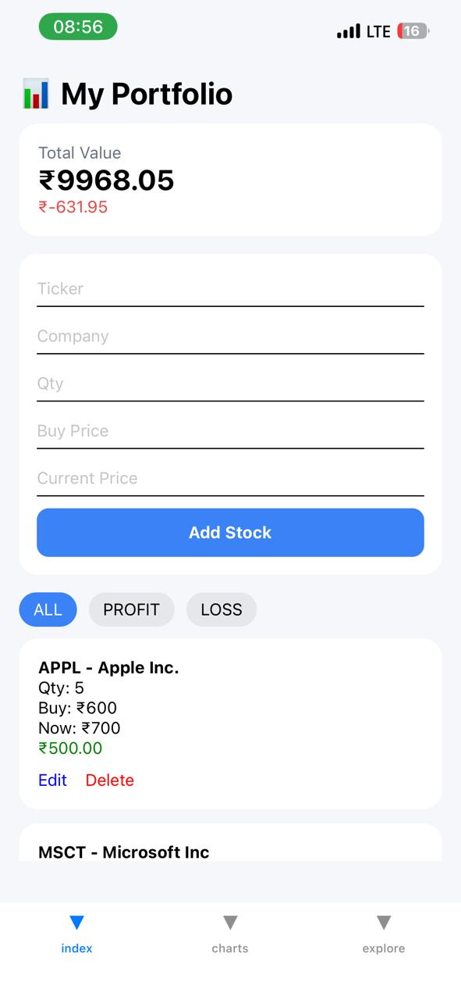
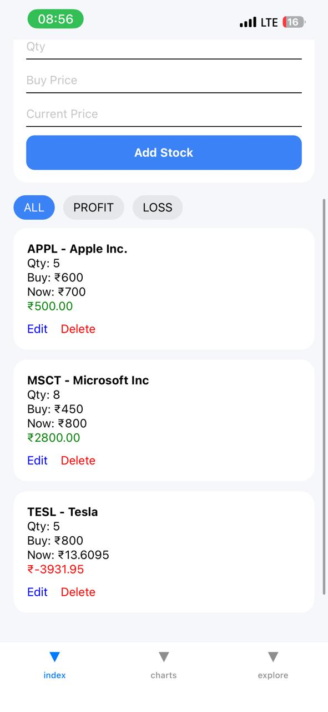
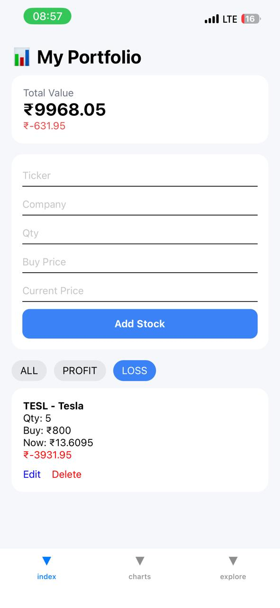

📈 React Native Stock App

A modern React Native Stock Market Tracking Application that allows users to monitor stock prices, visualize trends using interactive charts, and manage a personal portfolio. The app focuses on clean UI, smooth performance, and real-time financial insights.

✨ Features

📊 Real-time stock price tracking

📈 Interactive charts (line/bar visualization)

💼 Portfolio / Watchlist management

📉 Historical stock data visualization

📋 Portfolio performance summary

⚡ Fast and responsive UI

🎨 Clean and minimal user interface

🛠️ Tech Stack

React Native

JavaScript / TypeScript

React Navigation

Zustand / Redux (State Management)

react-native-chart-kit

Stock Market API (Alpha Vantage / Finnhub / Yahoo Finance)

Axios / Fetch API

📱 App Screens

💼 Portfolio Screen – Saved stocks and performance tracking

📊 Charts Screen – Stock price visualization with graphs

🏠 Explore Screen – Portfolio overview & market summary

🏗️ Project Structure
react-native-stock-app/│├── src/│   ├── components/        # Reusable UI components│   ├── screens/           # App screens (Home, Charts, Portfolio)│   ├── navigation/        # React Navigation setup│   ├── store/            # Zustand / Redux store│   ├── services/         # API calls (stock data)│   ├── constants/        # Theme, colors, configs│   └── utils/            # Helper functions│├── assets/               # Images & icons├── App.tsx              # Root component└── package.json

⚙️ Installation
Clone the repository:
git clone https://github.com/your-userna/react-native-stock-app.gitcd react-native-stock-app
Install dependencies:
npm install# oryarn install

▶️ Run the App
Android
npx react-native run-android
iOS
npx react-native run-ios

🔑 Environment Variables
Create a .env file in the root directory:
STOCK_API_KEY=BASE_URL=https://www.alphavantage.co/query

📊 Core Functionality

Fetch live stock data from API

Render dynamic stock charts

Store and manage portfolio locally/state

Track stock performance over time

Visual comparison of gains/losses

## 📸 Screenshots

### 🏠 Home / Index Page
| Screen 1 | Screen 2 |
|----------|----------|
|  |  |

| Screen 3 | Screen 4 |
|----------|----------|
|  |  |

---

### 📊 Charts Page
| Chart View 1 | Chart View 2 |
|--------------|--------------|
|  |  |

---

### 🔍 Explore Page
| Explore Screen |
|----------------|
|  |

🧠 Future Enhancements

🔔 Push notifications for price alerts

📰 Real-time financial news integration

🤖 AI-based stock prediction system

🔍 Stock search functionality

☁️ Cloud sync for portfolio backup

📊 Advanced analytics dashboard

🚀 Key Highlights

Optimized React Native performance

Modular and scalable architecture

Reusable component-based design

Clean separation of concerns (UI, API, State)

🤝 Contributing
1. Fork the repository 
2. Create a feature branch  
3. Commit your changes 
 4. Push and create a Pull Request  

📄 License
This project is licensed under the MIT License.

👨‍💻 Developer
Priya Shilpakar
Frontend Developer | React Native Enthusiast
Passionate about building clean UI and scalable mobile applications.

